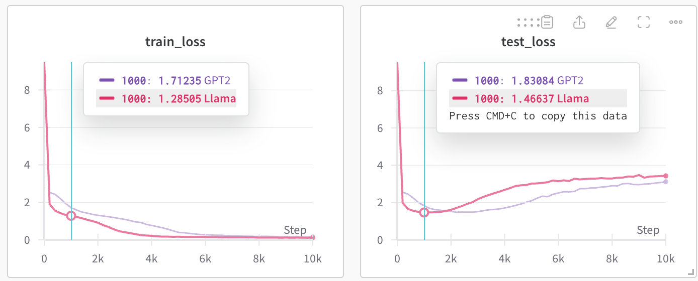

# Minimal Pytorch of GPT2, Llama

This repo provides the minimal Pytorch implementation of GPT2 and Llama.

## 0. Install dependencies

```bash
git clone https://github.com/qiuqiangkong/mini_llm

# Install Python environment
conda create --name llm python=3.10

# Activate environment
conda activate llm

# Install Python packages dependencies
sh env.sh
```

## 1. Train

```python
CUDA_VISIBLE_DEVICES=0 python train.py --model_name=Llama
```

We train the languge model on the Shakespeares dataset with 1 million characters. The training takes around 20 min to train on a single RTX4090. 



## 2. Sample

```python
CUDA_VISIBLE_DEVICES=1 python sample.py --model_name=Llama --ckpt_path="checkpoints/train/Llama/step=10000.pth"
```

The sampled texts look like:

<pre>
We may! though a bald prove. We three, I say! What                    
must I see so, most heart?

Servant:
He hath ribbons of an the city, which he main for her
voices of the same winder. What say you to yours?

Provost:
It was commanded so willingly I do at ever.
So fortune
</pre>

## External links

Part of code are modified from the following repos.

NanoGPT: https://github.com/karpathy/nanoGPT

Lit-Llama: https://github.com/Lightning-AI/lit-llama